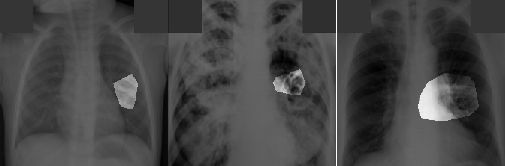

# Tuberculosis-Net (TB-Net) #

	
	 

**Note: The TB-Net model provided here is intended to be used as a reference model that can be built upon and enhanced as new data becomes available. It is currently at a research stage and not yet intended as a production-ready model (not meant for direct clinical diagnosis). We are working continuously to improve it as new data becomes available. Please do not use TB-Net for self-diagnosis; seek help from your local health authorities.**

	
	 
	<em>Example chest x-ray images from 3 different patients, and their associated critical factors (highlighted in white) as identified by GSInquire. In this example, all three lungs have been diagnosed with tuberculosis.</em>

Tuberculosis (TB) remains a global health problem, and is the leading cause of death from an infectious disease. A crucial step in the treatment of tuberculosis is screening high risk populations and the early detection of the disease, with chest x-ray (CXR) imaging being the most widely-used imaging modality. As such, there has been significant recent interest in artificial intelligence-based TB screening solutions for use in resource-limited scenarios where there is a lack of trained healthcare workers with expertise in CXR interpretation. Motivated by this pressing need, we introduce TB-Net, a self-attention deep convolutional neural network tailored for TB case screening. More specifically, we leveraged machine-driven design exploration to build a highly customized deep neural network architecture with attention condensers. We conducted an explainability-driven performance validation process to validate TB-Net's decision-making behaviour. Experiments using the Tuberculosis Chest X-Ray benchmark dataset showed that the proposed TB-Net is able to achieve accuracy/sensitivity/specificity of 99.86%/100.0%/99.71%. Radiologist validation was conducted on select cases by two board-certified radiologists with over 10 and 19 years of experience, respectively, and showed consistency between radiologist interpretation and critical factors leveraged by TB-Net for TB case detection.  While not a production-ready solution, We hope that the release of TB-Net will support researchers, clinicians, and citizen data scientists in advancing this field.

The World Health Organization (WHO) recently introduced a new recommendation that, for those aged 15 years and older in populations in which TB screening is recommended, computer-aided detection (CAD) approaches may be used in place of human readers for interpreting digital chest X-rays for screening and triaging TB. https://apps.who.int/iris/bitstream/handle/10665/340255/9789240022676-eng.pdf

For a more detailed description of the methodology behind TB-Net, please click [here](docs/TBNet.pdf).

If there are any technical questions after the README, FAQ, and past/current issues have been read, please post an issue or contact:
* james.lee@darwinai.ca

## Table of Contents ##
1. [Requirements](#requirements) to install on your system
2. [Dataset recreation](#dataset-recreation)
3. Steps for [training, evaluation and inference](docs/train_eval_inference.md) of TB-Net
4. [Results](#results)
5. [Links to pretrained models](docs/models.md)

## Requirements ##

The main requirements are listed below. A full list can be found in "requirements.txt".

* Tested with Tensorflow 1.15
* OpenCV 4.5.1
* Python 3.6
* Numpy 1.19.5
* Scikit-Learn 0.24.1

For OpenCV, you may need to install some system dependencies:
`apt-get install -y --no-install-recommends libgl1-mesa-glx libglib2.0-0`

Python packages can be installed with:
`python3 -m pip install -r requirements.txt`

## Dataset Recreation ##

To recreate the dataset that we used for our experiments, follow these steps:
1. Download the original dataset [here](https://www.kaggle.com/tawsifurrahman/tuberculosis-tb-chest-xray-dataset).
2. Extract the files.
3. Run the `create_dataset.py` script, making sure to point the 'datapath' argument at the root directory containing the extracted files. This script will perform pre-processing on all the images, converting them into the format we used. 
4. Wait for the processing to complete.

## Results ##

These are the final results for TB-Net on the test dataset.
The test dataset contains 348 normal samples and 345 tuberculosis samples.

<table class="tg">
  <tr>
    <th class="tg-7btt" colspan="5">TB-Net Details</th>
  </tr>
  <tr>
    <td class="tg-7btt">Accuracy</td>  
    <td class="tg-7btt">Sensitivity</td>
    <td class="tg-7btt">Specificity</td>
    <td class="tg-7btt"># Params (M)</td>
    <td class="tg-7btt">MACs (G)</td>  
  </tr>
  <tr>
    <td class="tg-c3ow">99.86</td>
    <td class="tg-c3ow">100.0</td>
    <td class="tg-c3ow">99.71</td>
    <td class="tg-c3ow">4.24</td>
    <td class="tg-c3ow">0.42</td>
  </tr>
</table>

